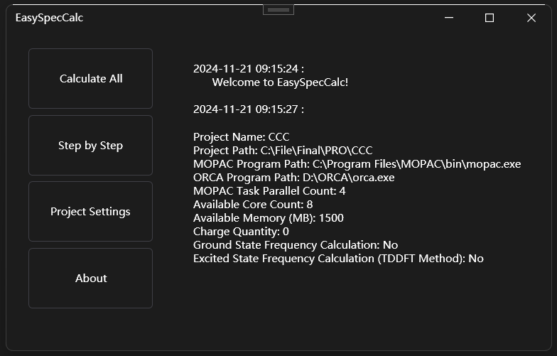
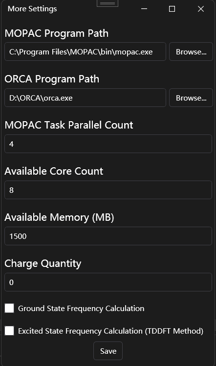

# EasySpecCalc
    
### Version: 0.0.1

EasySpecCalc is a simple spectral calculation tool,  designed to assist researchers in spectral analysis.

  

  

The program provides a fully automated workflow from molecular formula to spectrum generation, with a wide range of customizable settings.

## Requirements

**For Conformer Search functionality:**
- Requires WSL2
- Use conda to install AmberTools23, and ensure the environment name is also set to `AmberTools23`.

**For Lowest Energy Search functionality:**
- Requires Mopac installation.

**For Ground and Excited States calculations:**
- Requires ORCA installation.

---

**Author**: Simon Zhu

## To-do

- Add intensity correction functionality.
- Add cross-platform support (~~Initially intended to be cross-platform, but UI and Core code became tightly coupled during development~~).
- Support more input formats.
- Add visualization capabilities for the results.
- Incorporate molecular dynamics support.

## Completed

- Built 3D structures from SMILES.
- Implemented Conformer Search and Lowest Energy Search.

